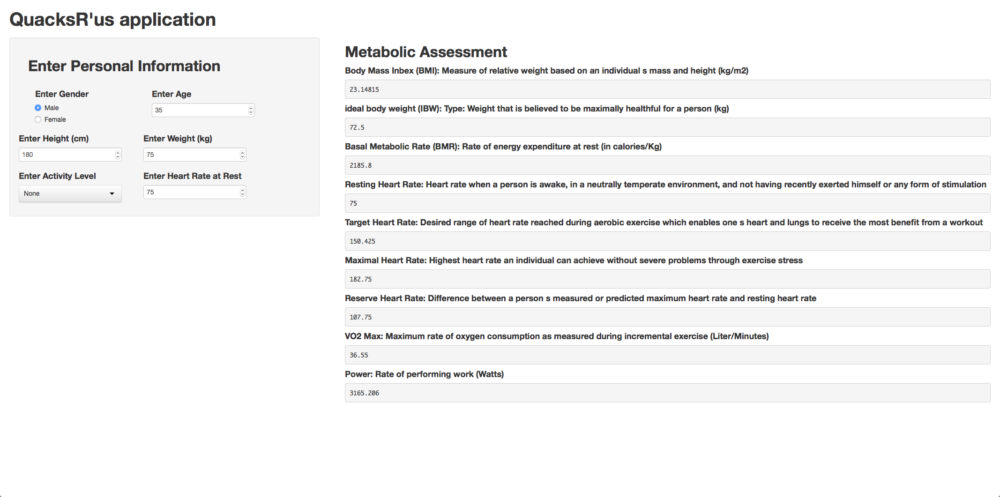

Building Data Products Presentation
========================================================
author: 
date: November 23, 2014
transition: concave

**QuacksR'Us Application**

Coursera


The Pitch    ;-)
========================================================
<small>
Our new revolutionary "QuacksR'us" application gives you the accurate metabolic assessment you've been searching for all your life.

Yes, you heard right, all the basic information you need to live a healthier, fuller and more 
balance life is now only a few clicks away.

It's extremely simple to use. Excessively fast. Strait-forward.  There is no need to 
visit a health specialist. And, more importantly, it can all be done 
without sweat in the confort of your home. 

So, drop that burger and be on your way to a brand new you

All you need is to provide our state of the art application  with some basic information and you, 
like millions before you, could also be on your way to a new and exciting life.

And, as if it wasn't enough, for a very limited time, all of this greatness can be yours 
for 3 easy payments of $19.99

So don't wait, join our legions of "QuacksR'us" satisfied customer

Shipping and handling not included
</small>

The application
========================================================
<small>
The image below shows the layout of the application.

- The left panel is use by the user to input data
- The right panel displays the estimated metabolic data
- Data is enter using radio buttons, selectInput and Numeri cInput objets to control what the user can enter.
</small>



Front End: Input & Metabolic Assessment
========================================================
left: 40%
<small>
**Input Data**

1. Gender
2. Age (in Years)
3. Height (in Centimeters)
4. Weight (In Kilograms)
5. Activity level 
6. Resting Heart Rate

***

**Metabolic Assessment**

1. Body Mass Index (BMI) (kg/m2)
2. Ideal Weight (in Kilograms)
3. Basal Metabolic Rate (BMR) (in cal/Kg)
4. Resting Heart Rate
5. Target Heart Rate
6. Maximal Heart Rate
7. Reserve Heart Rate
8. VO2 Max (Liter/Minutes)
9. Power (in Watts)
</small>

Back End: Formulas and Calculations
========================================================
<small>
Below is an illustration of the inner working of the predictive model showing the calculations for the Body Mass Index (BMI) and the Ideal Weight


```r
Gender <- 1; Activity_Level <-1; Weight <- 75 ;Height <- 180; Age <- 35

BMI <- Weight/((Height/100)^2)
BMI
```

```
[1] 23.15
```


```r
IdealWeight<- if(Gender == 1){ Height - 100 - (Height -150)/4 
} else {Height - 100 - (Height -150)/2.5 }
IdealWeight
```

```
[1] 72.5
```

Note: Even though formulas implemented  were sourced from different web sites the application isn't meant as a real metabolic assessment tool. It was only built to illustrate the concept discussed in the frame of the Building Data products course.     
</small>


